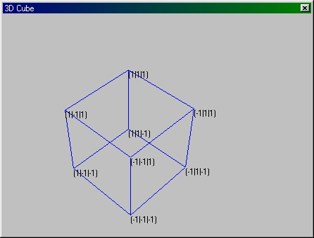



## Cube 3\-D

### Description

My Code has a Module for 3D Painting(Points, Lines and Text at the moment). As a example there is a 3D Cube Painted. It can be moved, turned and zoomed...

I had to use some code from a PSC example. But my code is better( I think) and very easy to understand.

Sorry but there are no comments at the moment.
 
### More Info
 

             |
---                |---
**Submitted On**   |2001-07-07 14:10:36
**By**             |[Loreno Heer](https://github.com/Planet-Source-Code/PSCIndex/blob/master/ByAuthor/loreno-heer.md)
**Level**          |Advanced
**User Rating**    |4.8 (19 globes from 4 users)
**Compatibility**  |VB 6\.0
**Category**       |[Graphics](https://github.com/Planet-Source-Code/PSCIndex/blob/master/ByCategory/graphics__1-46.md)
**World**          |[Visual Basic](https://github.com/Planet-Source-Code/PSCIndex/blob/master/ByWorld/visual-basic.md)
**Archive File**   |[Cube 3\-D22361772001\.zip](https://github.com/Planet-Source-Code/loreno-heer-cube-3-d__1-24802/archive/master.zip)

